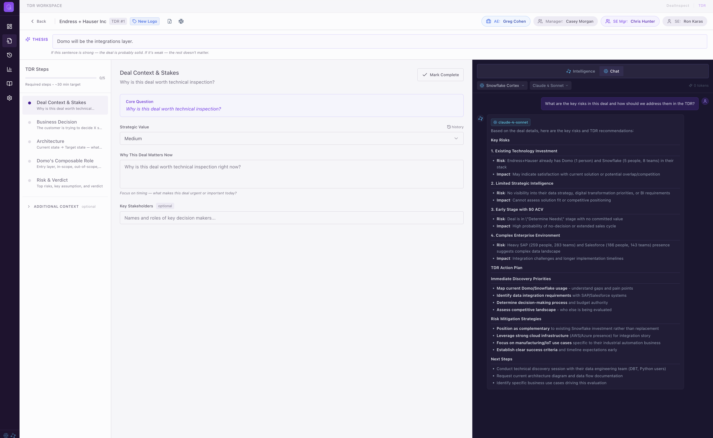
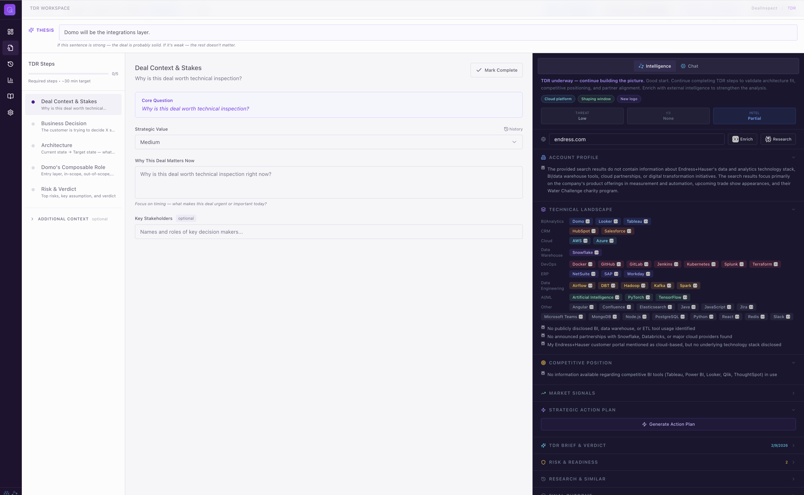
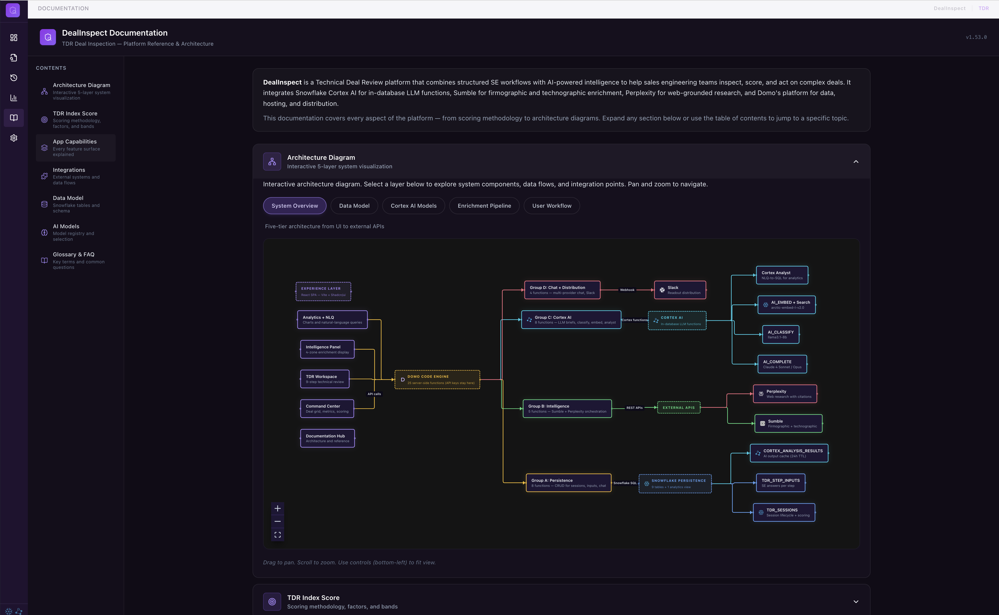
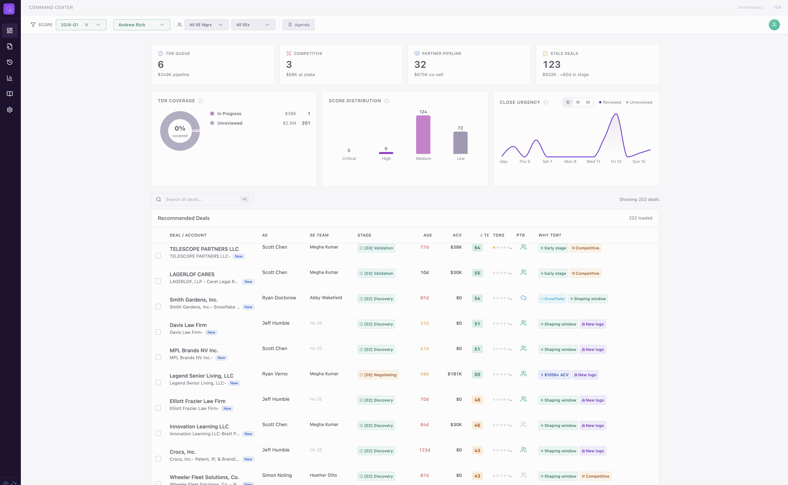

# DealInspect

> **AI-powered Technical Deal Review platform for sales engineering teams.** Inspect, score, and act on complex deals — combining deterministic scoring, multi-model AI intelligence, and ML-driven win propensity into a single operational workspace.


---

## Table of Contents

1. [What Problem Does This Solve?](#what-problem-does-this-solve)
2. [Architecture](#architecture)
3. [Key Capabilities](#key-capabilities)
4. [TDR Index — Scoring Engine](#tdr-index--scoring-engine)
5. [AI & Intelligence Stack](#ai--intelligence-stack)
6. [Deal Close Propensity ML](#deal-close-propensity-ml)
7. [Pages & Navigation](#pages--navigation)
8. [Data Model](#data-model)
9. [Design System](#design-system)
10. [Development & Deployment](#development--deployment)
11. [Project Structure](#project-structure)
12. [License](#license)

---

## What Problem Does This Solve?

SE managers oversee dozens of active deals. Some require a **Technical Deal Review (TDR)** — a structured inspection to validate architecture, partner strategy, and competitive positioning before decisions lock in. The challenge: **which deals, and when?**

DealInspect answers this by combining **three intelligence signals**:

| Signal | Source | Question It Answers | Status |
|--------|--------|---------------------|--------|
|  | 9-factor scoring engine | *"How technically complex is this deal?"* |  |
|  | 17-factor framework | *"Which deals should I review first?"* |  |
|  | ML model (Snowpark Python) | *"How likely is this deal to close?"* |  |

The platform then provides a structured workspace to *conduct* the review — with context-aware chat, external account intelligence, Cortex-generated briefs, and Slack distribution of the final readout.

---

## Architecture

DealInspect is a **four-layer system**. Each layer is independently valuable; together they compound.

```
┌─────────────────────────────────────────────────────────────────────────┐
│                     EXPERIENCE LAYER (React SPA)                        │
│                                                                         │
│   Command Center  │  TDR Workspace  │  Inline Chat  │  Analytics       │
│   Documentation   │  TDR History    │  Settings     │  PDF Readout     │
│                                                                         │
└─────────────────────────────────────┬───────────────────────────────────┘
                                      │
                                      ▼
┌─────────────────────────────────────────────────────────────────────────┐
│                  INTELLIGENCE LAYER (Domo Code Engine)                   │
│                                                                         │
│   Snowflake Cortex AI          │  Perplexity        │  Sumble          │
│   ├─ AI_COMPLETE (briefs)      │  (web research,    │  (firmographic,  │
│   ├─ AI_CLASSIFY (tags)        │   citations)       │   technographic, │
│   ├─ AI_EXTRACT (entities)     │                    │   competitive)   │
│   ├─ AI_EMBED (similarity)     ├────────────────────┤                  │
│   ├─ AI_SENTIMENT (health)     │  Domo AI           │  Slack           │
│   ├─ Cortex Analyst (NL→SQL)   │  (17-factor TDR    │  (readout        │
│   └─ Cortex Search (hybrid)    │   recommendations) │   distribution)  │
│                                                                         │
└─────────────────────────────────────┬───────────────────────────────────┘
                                      │
                                      ▼
┌─────────────────────────────────────────────────────────────────────────┐
│                     PERSISTENCE LAYER (Snowflake)                       │
│                                                                         │
│   TDR_SESSIONS  │  TDR_STEP_INPUTS  │  TDR_CHAT_MESSAGES              │
│   TDR_STRUCTURED_EXTRACTS  │  TDR_READOUTS  │  TDR_DISTRIBUTIONS      │
│   ACCOUNT_INTEL_SUMBLE  │  ACCOUNT_INTEL_PERPLEXITY                    │
│   API_USAGE_LOG  │  CORTEX_ANALYSIS_RESULTS                            │
│   ML_FEATURE_STORE  │  DEAL_ML_PREDICTIONS  │  ML_MODEL_METADATA      │
│                                                                         │
└─────────────────────────────────────┬───────────────────────────────────┘
                                      │
                                      ▼
┌─────────────────────────────────────────────────────────────────────────┐
│                      DATA LAYER (Source Systems)                        │
│                                                                         │
│   SFDC Opportunities  │  SE Mapping  │  Forecasts  │  WCP Weekly       │
│   (via Domo Datasets — existing, unchanged)                            │
│                                                                         │
└─────────────────────────────────────────────────────────────────────────┘
```

| Layer | Technology | Core Principle |
|-------|-----------|---------------|
|  | React 18 · TypeScript · Tailwind | Every interaction is contextual — chat, research, briefs, and insights happen inline without leaving the TDR workflow |
|  | Cortex AI · Perplexity · Sumble · Domo AI | Three AI backends, one unified context — Cortex for stored data, Perplexity for live web, Domo AI for candidate ranking |
|  | Snowflake · Snowpark Python | Everything is append-only — every edit, research pull, and chat message creates a timestamped row for full posterity |
|  | Domo Datasets | SFDC remains the source of truth — the app enriches it but never replaces it |

---

## Key Capabilities

###  Command Center

The operational dashboard for SE managers. Shows pipeline metrics, TDR priority distribution, close urgency trends, and a scored deals table with actionable "Why TDR?" pills. Deals can be pinned to an **Agenda** for the next TDR meeting. Domo AI auto-suggests the top 5 candidates.

<p align="center">
  
</p>

###  TDR Workspace

A three-panel layout for conducting a Technical Deal Review:

| Panel | Content |
|-------|---------|
|  | 5 required + 4 optional TDR steps with progress tracking |
|  | Structured input area with per-field save and edit history |
|  | Account profile, tech landscape, competitive position, market signals, action plan, brief & verdict, risk scoring, research & similar deals |

<p align="center">
  
</p>

###  Inline Chat

Context-aware conversational AI embedded in the workspace. The chat knows the current deal, all TDR inputs, and all cached account intelligence.

| Provider | Best For | Data Routing |
|----------|----------|---------|
|  | Questions about stored TDR/account data | In-database — no data leaves Snowflake |
|  | Complex reasoning, TDR strategy | Via Cortex AI_COMPLETE |
|  | Real-time web research with citations | External API via Code Engine |

<p align="center">
  
</p>

###  Account Intelligence

One-click enrichment for any deal:

| Source | What You Get |
|--------|-------------|
|  | Industry, revenue, employee count, BI/CRM/cloud/DevOps/AI tool stack with confidence scores, competitive tool landscape |
|  | Strategic initiatives, market position, technology decisions, competitive dynamics — with source citations |

###  TDR Readout & Distribution

After completing a TDR, generate an executive-ready **PDF readout** and distribute to Slack channels with AI-generated summary, deal team @mentions, and the PDF attached.

###  Portfolio Analytics

Cross-deal pattern analysis powered by structured TDR extracts. Includes an NLQ hero bar (*"Ask Your TDR Data"*) backed by Cortex Analyst, plus charts for competitor frequency, platform distribution, entry layer patterns, risk categories, and TDR status distribution.

###  Documentation Hub

In-app reference covering scoring methodology, app capabilities, integrations, Snowflake data model, AI model registry, glossary, and an interactive **5-layer architecture diagram** with pan/zoom navigation.

<p align="center">
  
</p>

---

## TDR Index — Scoring Engine


The TDR Index is a deterministic 9-component scoring engine. Base score starts at **0** — every point must be earned. Most deals land LOW or MEDIUM; only complex, high-value deals with multiple converging signals reach HIGH or CRITICAL.

### The 9 Components

| # | Component | Range | Key Logic |
|---|-----------|-------|-----------|
| 1 |  | 0–20 | ≥$250K → 20 · ≥$100K → 15 · ≥$50K → 10 |
| 2 |  | 0–15 | Stage 2 (Determine Needs) → 15 · Stage 3 → 12 |
| 3 |  | 0–15 | Snowflake / Databricks / BigQuery → 15 |
| 4 |  | 0–10 | ≥2 competitors → 10 |
| 5 |  | 0–10 | New Logo → 10 · Acquisition → 8 |
| 6 |  | 0–10 | Probable → 10 · Best Case → 8 |
| 7 |  | −10 to +5 | ≤14d → +5 · >180d → −10 |
| 8 |  | 0–10 | PA prefix → +5 · Multi-component → +3 |
| 9 |  | 0–5 | Co-sell → 5 · Reseller → 3 |

### Priority Bands

| Priority | Score | Action |
|----------|-------|--------|
|  | ≥ 75 | Immediate TDR — multiple Tier 1 signals converging |
|  | 50–74 | TDR strongly recommended |
|  | 25–49 | Monitor for escalation |
|  | < 25 | Standard process |

### "Why TDR?" Pills

Each deal gets up to **2 colored pills** explaining *why* it scored the way it did:


Each pill includes an icon, dynamic label, and strategy tooltip.

### Post-TDR Score Augmentation

After a TDR begins, the score evolves with **4 additional components**:

| Component | Range | Purpose |
|-----------|-------|---------|
|  | 0–10 | Known competitive threats surface from enrichment |
|  | 0–5 | Reward for intelligence-gathering effort |
|  | 0–10 | Percentage of TDR steps completed |
|  | 0–5 | Risks identified and acknowledged |

---

## AI & Intelligence Stack


DealInspect uses AI at **eleven distinct points**, each with a different purpose:

| Function | AI Backend | Purpose | Trigger |
|----------|-----------|---------|---------|
|  | Domo AI (text/chat) | 17-factor framework scores top 40 deals by ACV | Automatic on data load |
|  | Cortex AI_COMPLETE | Synthesizes all inputs/intel into executive summary | User-initiated |
|  | Cortex AI_EXTRACT | Pulls competitors, technologies, risks from free text | After TDR step |
|  | Cortex AI_CLASSIFY | Categorizes Perplexity research findings | After enrichment |
|  | Cortex AI_AGG | Cross-deal pattern analysis from structured extracts | Analytics page |
|  | Cortex AI_SENTIMENT | TDR health trend over time | Per-session |
|  | Cortex AI_EMBED | Semantic similarity search across past TDRs | Intelligence panel |
|  | Cortex Analyst | "Ask Your TDR Data" — NL → SQL → results | Analytics page |
|  | Cortex / Perplexity / Domo | Context-aware Q&A within the workspace | User-initiated |
|  | Cortex AI_COMPLETE | Slack-formatted TDR outcome summary | Share workflow |
|  | Cortex AI_COMPLETE | Summarize fileset/knowledge base search results | Intelligence panel |

> All external API calls route through **Domo Code Engine functions**, keeping API keys server-side and the frontend stateless.

---

## Deal Close Propensity ML


> Infrastructure defined · Training procedures written · Frontend integration pending

### The Problem

The deterministic TDR score answers *"How technically complex is this deal?"* but not *"How likely is this deal to close?"* A deal can score 85 on TDR complexity yet have a **15% chance of closing**. SE managers need both axes to allocate review time effectively.

### The Solution — Two-Axis Prioritization

A stacking ensemble ML model predicts `P(close)` for every pipeline deal. The propensity score composes with the deterministic TDR score to create a **2×2 quadrant**:

| |  |  |
|---|---|---|
|  | 🔴 **CRITICAL** — winnable + complex, TDR adds most value | ⚠️ **MONITOR** — complex but unlikely, investigate blockers |
|  | ✅ **LOW TOUCH** — likely to close, minimal SE intervention | ⬜ **DEPRIORITIZE** — unlikely + simple, not worth TDR time |

### Model Architecture

```
Level 0 (Base Models)          Level 1 (Meta-Learner)
┌─────────────────────┐
│  XGBoost            │───┐
│  LightGBM           │───┤   ┌───────────────────────┐
│  RandomForest       │───┼──▶│  LogisticRegression   │──▶ P(close)
│  LogisticRegression │───┘   │  (learned weights)    │
└─────────────────────┘       └───────────────────────┘
         │
    5-fold stratified CV
    (out-of-fold predictions)
```

| Design Decision | Detail |
|-----------------|--------|
|  | `Is Won` label — clean, auditable ground truth |
|  | SMOTE oversampling or class-weight balancing |
|  | SHAP values per prediction — every score is transparent |
|  | Native `SNOWFLAKE.ML.CLASSIFICATION` runs alongside; ensemble must beat by >2% AUC |

### 19 Engineered Features

| Category | Features |
|----------|----------|
|  | Account win rate, type-specific win rate |
|  | Stage velocity ratio, quarter urgency, days in stage, deal age |
|  | Deal complexity index, competitor count, line item count |
|  | Services ratio, ACV normalized, revenue per employee |
|  | Sales process completeness, steps completed, has thesis, has stakeholders |
|  | Stage ordinal, deal complexity encoded, AI maturity encoded |

### Snowflake Infrastructure

| Object | Type | Purpose |
|--------|------|---------|
|  | Table | Pre-computed derived features, versioned by date |
|  | Table | Batch scoring results + SHAP explanations + risk flags |
|  | Table | Model registry with versioning, metrics, and lifecycle |
|  | Snowpark Procedure | Trains ensemble with 5-fold CV |
|  | Snowpark Procedure | Batch/single prediction with SHAP |
|  | Scheduled Task | Daily automated scoring (7 AM UTC) |
|  | Scheduled Task | Biweekly retraining (1st & 15th) |
|  | Alert | Triggers if AUC-ROC drops below 0.65 |

### Planned Frontend Surfaces

| Surface | Integration |
|---------|------------|
|  | Win Probability column with color-coded confidence |
|  | SHAP top factors and risk flags per deal |
|  | Architecture diagram update + model registry reference |

---

## Pages & Navigation

The app uses a collapsible sidebar with **6 routes**:

| Route | Page | Description |
|-------|------|-------------|
|  | **Command Center** | Pipeline dashboard — metrics, charts, scored deals table, agenda |
|  | **TDR Workspace** | Three-panel TDR review — steps, inputs, intelligence + chat |
|  | **TDR History** | Past TDR reviews with search and outcome filters |
|  | **Portfolio Analytics** | Cross-deal patterns, NLQ, competitor/platform/risk charts |
|  | **Documentation Hub** | In-app reference — scoring, architecture, data model, glossary |
|  | **Settings** | Allowed managers, ACV thresholds, feature flags, API toggles |

---

## Data Model

###  Domo Datasets

| Alias | Purpose |
|-------|---------|
| `opportunitiesmagic` | Primary pipeline data — all open SFDC opportunities |
| `forecastsmagic` | Manager-level forecast calls by quarter |
| `wcpweekly` | Weekly commit pipeline snapshots |
| `semapping` | SE-to-Manager lookup (29 rows) |

###  Snowflake Persistence

| Table | Purpose |
|-------|---------|
| `TDR_SESSIONS` | Session lifecycle, status, outcome |
| `TDR_STEP_INPUTS` | Per-field inputs with edit history |
| `TDR_CHAT_MESSAGES` | Multi-turn chat conversations per session |
| `TDR_STRUCTURED_EXTRACTS` | AI-extracted entities (competitors, technologies, risks) |
| `TDR_READOUTS` | Generated readout metadata |
| `TDR_DISTRIBUTIONS` | Slack distribution audit log |
| `ACCOUNT_INTEL_SUMBLE` | Firmographic + technographic enrichment |
| `ACCOUNT_INTEL_PERPLEXITY` | Web research with citations |
| `CORTEX_ANALYSIS_RESULTS` | Cached AI analysis outputs (briefs, classifications) |
| `API_USAGE_LOG` | Per-call cost and latency tracking |

###  ML Tables

| Table | Purpose |
|-------|---------|
| `ML_FEATURE_STORE` | 19 derived features per opportunity, date-versioned |
| `DEAL_ML_PREDICTIONS` | Win probability + SHAP explanations + risk flags |
| `ML_MODEL_METADATA` | Model registry — versions, metrics, artifacts, lifecycle |

---

## Design System

### Color Palette

Source: [coolors.co palette](https://coolors.co/palette/56e39f-59c9a5-5b6c5d-3b2c35-2a1f2d)

| Swatch | Name | Hex | Usage |
|--------|------|-----|-------|
|  | Emerald | `#56E39F` | Success states, Critical priority |
|  | Teal | `#59C9A5` | Accents, High priority |
|  | Sage | `#5B6C5D` | Muted foregrounds, borders |
|  | Plum | `#3B2C35` | Primary buttons, badges |
|  | Aubergine | `#2A1F2D` | Sidebar, deep surfaces |

The app supports  and  via CSS custom properties. The Documentation Hub forces dark mode for visual cohesion with architecture diagrams.

---

## Development & Deployment

### Prerequisites


### Local Development

```bash
npm install
npm run dev          # Vite dev server at localhost:5173
```

> In dev mode, Domo SDK is unavailable — data hooks return mock data, AppDB falls back to `localStorage`, and AI functions return simulated responses.

### Build & Deploy

```bash
npm run build        # Production build → dist/
npm run deploy       # Build + publish to Domo
npm run deploy:zip   # Build + create ZIP for manual upload
npm run deploy:check # Verify manifest, thumbnail, SDK reference
```

### ML Development


The ML modeling environment uses Python 3.10 (matching the Snowpark runtime):

```bash
python3.10 -m venv ml-venv
source ml-venv/bin/activate
pip install -r notebooks/requirements.txt
jupyter notebook
```

Notebooks in `notebooks/` are the prototyping environment — feature engineering and model training are iterated locally, then promoted to Snowflake stored procedures once validated.

---

## Project Structure

```
deal-inspect/
├── README.md
├── IMPLEMENTATION_STRATEGY.md       # Full implementation strategy (28 sprints)
├── manifest.json                    # Domo app manifest (datasets, collections, version)
├── package.json
├── vite.config.ts
├── tailwind.config.ts
│
├── src/
│   ├── App.tsx                      # Router + providers
│   ├── main.tsx                     # Entry point
│   ├── index.css                    # Design system (CSS variables)
│   │
│   ├── types/
│   │   └── tdr.ts                   # Core types: Deal, TDRStep, TDRSessionSummary
│   │
│   ├── lib/
│   │   ├── domo.ts                  # Domo data fetching + field normalization
│   │   ├── domoAi.ts                # Domo AI 17-factor TDR recommendations
│   │   ├── snowflakeStore.ts        # Snowflake persistence (sessions, inputs)
│   │   ├── cortexAi.ts              # Cortex AI functions (brief, classify, extract, embed)
│   │   ├── accountIntel.ts          # Sumble + Perplexity enrichment orchestration
│   │   ├── filesetIntel.ts          # Domo Fileset search + KB summarization
│   │   ├── tdrChat.ts               # Multi-provider chat (Cortex, Perplexity, Domo)
│   │   ├── tdrReadout.ts            # Readout assembly + Slack distribution
│   │   ├── tdrCriticalFactors.ts    # Scoring engine + factor detection
│   │   ├── appDb.ts                 # AppDB fallback for TDR sessions
│   │   ├── appSettings.ts           # localStorage settings
│   │   ├── constants.ts             # Allowed managers, thresholds, TDR steps
│   │   ├── tooltips.ts              # Dynamic tooltip content
│   │   └── utils.ts                 # cn() helper (clsx + tailwind-merge)
│   │
│   ├── hooks/
│   │   └── useDomo.ts               # Main data hook (fetch, join, enrich, filter)
│   │
│   ├── pages/
│   │   ├── CommandCenter.tsx         # Dashboard — metrics, charts, deals table, agenda
│   │   ├── TDRWorkspace.tsx          # Three-panel TDR review workspace
│   │   ├── TDRHistory.tsx            # Past TDR reviews
│   │   ├── TDRAnalytics.tsx          # Portfolio analytics + NLQ
│   │   ├── Documentation.tsx         # In-app reference hub
│   │   └── Settings.tsx              # App configuration
│   │
│   ├── components/
│   │   ├── TopBar.tsx                # Filter bar (quarter, manager, SE, priority)
│   │   ├── AppSidebar.tsx            # Collapsible navigation sidebar
│   │   ├── DealsTable.tsx            # Scored deals table with pills + tooltips
│   │   ├── AgendaSection.tsx         # Pinned deals + AI suggestions
│   │   ├── DealSearch.tsx            # Global deal search
│   │   ├── TDRSteps.tsx              # Step progress (workspace left panel)
│   │   ├── TDRInputs.tsx             # Step inputs (workspace center panel)
│   │   ├── TDRIntelligence.tsx       # Intelligence panel (workspace right panel)
│   │   ├── TDRChat.tsx               # Multi-provider chat component
│   │   ├── TDRShareDialog.tsx        # Slack distribution dialog
│   │   ├── CortexBranding.tsx        # Cortex AI model badges
│   │   ├── charts/
│   │   │   ├── TDRCoverageChart.tsx
│   │   │   ├── ScoreDistributionChart.tsx
│   │   │   └── CloseUrgencyChart.tsx
│   │   ├── docs/                     # Documentation Hub sections
│   │   │   ├── ArchitectureDiagram.tsx
│   │   │   ├── ScoringReference.tsx
│   │   │   ├── CapabilitiesGuide.tsx
│   │   │   ├── IntegrationsReference.tsx
│   │   │   ├── DataModelReference.tsx
│   │   │   ├── AIModelsReference.tsx
│   │   │   └── GlossaryReference.tsx
│   │   ├── pdf/
│   │   │   ├── TDRReadoutDocument.tsx  # React-PDF readout template
│   │   │   └── readoutTypes.ts
│   │   ├── icons/                    # Brand icons (Domo, Perplexity, Slack, Sumble)
│   │   └── ui/                       # shadcn/ui primitives
│   │
│   ├── layouts/
│   │   └── MainLayout.tsx            # Sidebar + <Outlet /> wrapper
│   │
│   └── data/
│       └── mockData.ts               # Mock deals for local development
│
├── sql/
│   └── bootstrap.sql                 # Snowflake DDL bootstrap
│
├── ml_infrastructure_ddl.sql         # ML schema, tables, views, stage, grants
├── ml_feature_computation.sql        # Feature engineering stored procedure
├── ml_training_procedure.sql         # Training + prediction + deployment procedures
├── ml_automation.sql                 # Tasks, Alerts, Streams, monitoring
│
├── notebooks/                        # ML prototyping (local Python)
│   └── 01_data_exploration.ipynb
│
├── codeengine/                       # Reference copies of Domo Code Engine functions
│                                     # (deployed via Domo CE IDE, not from this repo)
│
└── docs/
    └── screenshots/                  # App screenshots for README
```

>  `codeengine/`, `samples/`, `dist/`, and `ml-venv/` are `.gitignore`d. Code Engine functions are deployed via the Domo Code Engine IDE. Build artifacts are generated with `npm run build`. The ML virtual environment is created locally per the [ML Development](#ml-development) instructions.

---

## License


This project is licensed under the [MIT License](LICENSE).
